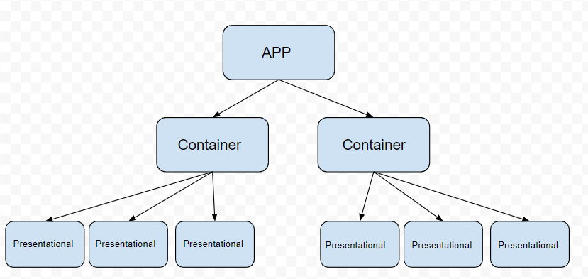
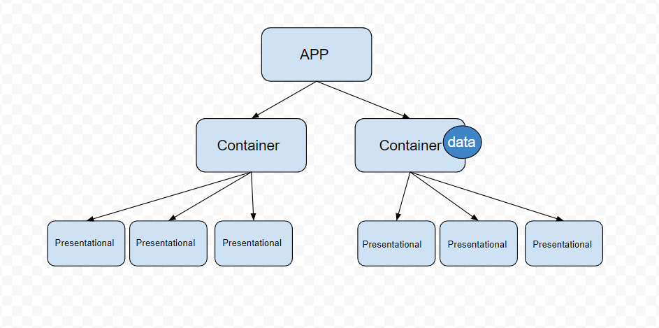
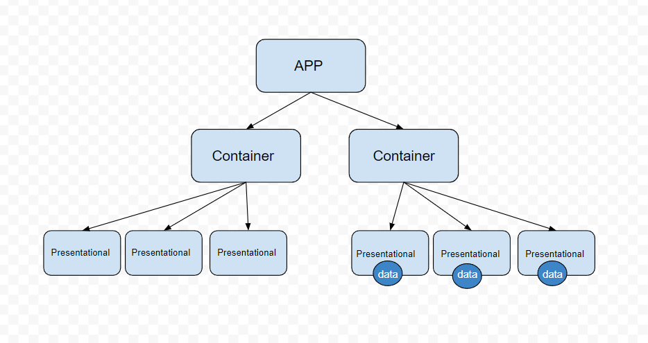

# React Props and Components

## Learning Goals

- [ ] **Use React build tools to scaffold a React application.**
- [ ] **Implement React Components to render JSX**
- [ ] **Pass data though component props**
- [ ] **Understand component hierarchy.**
- [ ] **Understand the roles of container components and presentational components.**

## React Component hierarchy



React components render in the form of a tree, with the App component acting as the root. The App component renders child components, which can either stand alone or render additional components. In the example above, the App component renders two container components, each of which renders three presentational components.

## Passing props




Data can be passed from a parent component to child components through an object called props.

```
function Parent() {
  //We pass the child component data with the syntax
   `name=value`
  return (
    <div>
      <Child data={{data:"foo"}} />
    </div>
  );
}

// In the Child component, we access the data through the `props` parameter and use dot notation to retrieve the value.

function Child(props){
    return (
    <div>
      <p>{props.data}</p>
    </div>
  );
}


```

## Higher Order Component

A higher-order component is similar to a higher-order function: it’s a component that returns another component.
In this example, we use a parent component to render multiple child components, one for each piece of data.

```
function Parent() {
  const data = [1, 2, 3, 4, 5];
  return (
    <div>
      {data.map(num => <Child key={num} data={num} />)}
    </div>
  );
}

function Child(props) {
  return <h2>{props.data}</h2>;
}

// This renders 5 <Child> components, each showing a number from the data array.

```

Notes:

Add a key prop (key={num}) so React can efficiently track each child in the list.

Each <Child> displays the number it receives through its data prop.

## Lab Deliverables

1. Create Container component

- Create a new file in the components folder called RestaurantsContainer.js.
- Inside this file, create a function named RestaurantsContainer that returns a div.
- Export the RestaurantsContainer function.
- In the App component, import RestaurantsContainer and render it within the div returned by App.

<details>
  <summary>Click Here to view solution</summary>

```

function RestaurantsContainer(props) {
  return (
    <div className="restaurantContainer">
    </div>
  );
}

export default RestaurantsContainer;


//In App.js
import RestaurantsContainer from "./components/RestaurantsContainer";
import "./App.css";

//App is the root of our application and where we load in our components.
function App() {
  return (
    <div className="App">
      <RestaurantsContainer/>
    </div>
  );
}

export default App;


```

</details>

2. Create a Presentational Component

- Create a new file called Restaurant
- Within it create a function called Restaurant that returns a div
- Export the function

<details>
  <summary>Click Here to view solution</summary>

```
function Restaurant() {
  return (
    <div className="restaurant">

    </div>
  );
}

export default Restaurant;


```

</details>

3. Use the container component to render multiple presentational components.

- import Restaurant to RestaurantsContainer
- import data from data/data.js to RestaurantsContainer
- add a pair of {} in the div being returned by RestaurantsContainer
- within those {} call .map() on the data array. Pass .map a callback that returns the Restaurant component

<details>
  <summary>Click Here to view solution</summary>

```
import { restaurants } from "./data/data.js";

import Restaurant from "./Restaurant";

function RestaurantsContainer() {
  return (
    <div className="restaurantContainer">
      {restaurants.map(restaurant => <Restaurant />)}
    </div>
  );
}

export default RestaurantsContainer;


```

</details>

4. Pass props from the container component to the presentational component.

- Pass the current restaurant being iterated over in the map function as a prop to the Restaurant component. Use the prop key restaurant to pass this value:

<details>
  <summary>Click Here to view solution</summary>

```
import { restaurants } from "./data/data.js";

import Restaurant from "./Restaurant";

//Containers are for behind the scenes logic
function RestaurantsContainer() {
  return (
    <div className="restaurantContainer">
      {restaurants.map(restaurant => <Restaurant key={restaurant.name} restaurant={restaurant} />)}
    </div>
  );
}

export default RestaurantsContainer;


```

</details>

5. Access props in the container component.

- In the Restaurant compoent create a paramater called props.
- Inside the div returned by the component, create elements to display the data. Access the data using props.restaurant.<dataKey>.
- Note: There’s additional data available for each restaurant that we aren’t currently rendering. If you’d like an extra challenge (and some extra credit), try displaying the menu as well.

<details>
  <summary>Click Here to view solution</summary>

```
function Restaurant(props) {

  return (
    <div className="restaurant">
      
      <h2>{props.restaurant.name}</h2>
      <ul>
        <li>{props.restaurant.address}</li>
        <li>{props.restaurant.phone}</li>
        <li>{props.restaurant.cuisine}</li>
        <li>⭐ {props.restaurant.rating}</li>
      </ul>
    </div>
  );
}

export default Restaurant;


```

</details>

## Submission Instructions

1. Push your code to GitHub.
2. Submit the link to your GitHub repository URL.
